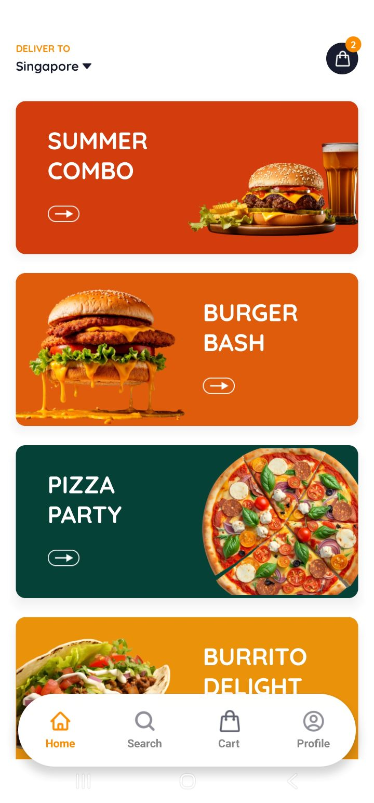

<div align="center">
  <br />
    <a align="center">
      
      
    </a>
  
  <br />

  <div>
    
    
        
    
    
  </div>

  <h3 align="center">Food Delivery Mobile App</h3>

</div>

## 📋 <a name="table">Table of Contents</a>

1. 🤖 [Introduction](#introduction)
2. ⚙️ [Tech Stack](#tech-stack)
3. 🔋 [Features](#features)
4. 🤸 [Quick Start](#quick-start)
5. 🎥 [Demo](#demo)


## <a name="introduction">🤖 Introduction</a>

A full-stack Food Delivery app built with React Native, TypeScript, and Tailwind CSS. It features Google Authentication, dynamic search, cart functionality, and smooth navigation. Powered by Appwrite for backend, database, and file storage, the app delivers a fast, responsive user experience with clean, modern UI.


## <a name="tech-stack">⚙️ Tech Stack</a>

- **[Appwrite]**  – Backend-as-a-service for auth, database, storage, and serverless functions.

- **[Expo](https://expo.dev/)** – Framework for building native apps (Android, iOS, web) using React Native.
  
- **[NativeWind](https://www.nativewind.dev/)** – Tailwind CSS utility classes for React Native UI styling.

- **[React Native](https://reactnative.dev/)** – Cross-platform mobile UI framework based on React.

- **[Tailwind CSS](https://tailwindcss.com/)** – Utility-first styling, integrated via NativeWind.

- **[TypeScript](https://www.typescriptlang.org/)**  – Typed JavaScript for improved code quality and scalability.

- **[Zustand](https://github.com/pmndrs/zustand)** – Lightweight state management for global app state.


## <a name="features">🔋 Features</a>

### Features of the Mobile Movie AppProject

👉 **Google Authentication**: Easy and secure authentication.

👉 **Home Page**: Highlights offers and entry to food search.

👉 **Search Page**: Explore food with categories and filters.

👉 **Product Details Page**: View details and add items to cart.

👉 **Cart Page**: Review items and total cost. 

👉 **Profile Page**: Manage user settings including edit and logout function.  

👉 **Appwrite Integration**: Handles backend database and file storage for food items.


## <a name="quick-start">🤸 Quick Start</a>

Steps to set up the project locally.

**Prerequisites**

Make sure you have the following installed on your machine:

- **[Git](https://git-scm.com/)**
- **[Node.js](https://nodejs.org/en)**
- **[npm](https://www.npmjs.com/)** _(Node Package Manager)_

**Cloning the Repository**

```bash
git clone https://github.com/adrianhajdin/food_ordering.git
cd food_ordering
```

**Installation**

Install the project dependencies using npm:

```bash
npm install
```

**Set Up Environment Variables**

Create a new file named `.env` in the root of your project and add the following content:

```env
EXPO_PUBLIC_APPWRITE_PROJECT_ID=
EXPO_PUBLIC_APPWRITE_ENDPOINT=
```

Replace the placeholder values with your actual Appwrite credentials.

**Running the Project**

```bash
npx expo start
```

Open your ExpoGO app on your phone and scan the QR code to view the project.

## <a name="demo">🎥 DEMO</a>

